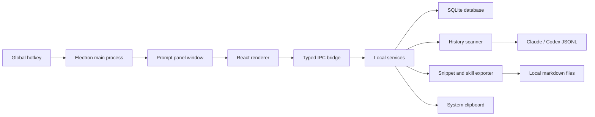

# Desktop Prompt Tool Design

## Purpose

Build the first desktop version of Agent Prompt Miner as a local-first prompt launcher for Codex and Claude Code users.

The PRD describes a CLI-first product. For this first usable desktop version, the product shifts the primary workflow from command-line review to a global-hotkey prompt panel:

```text
press global hotkey -> search prompt -> copy or export -> reuse in Codex / Claude Code
```

The CLI scanning idea remains part of the product, but it becomes a local background capability inside the desktop app.

## First-Version Goals

1. Provide a fast desktop prompt panel that can be opened by global hotkey.
2. Let the user search, filter, preview, and copy common prompts.
3. Scan local Codex and Claude Code history files to generate reusable prompt candidates.
4. Store prompts, candidates, usage events, and settings locally in SQLite.
5. Export selected candidates as snippets, Claude Skills, or Codex Skills only after preview and confirmation.
6. Show basic usage analytics so the user can see which prompts and categories are used most often.
7. Preserve the PRD privacy model: no upload, no remote LLM, no telemetry, and no assistant/tool-result ingestion by default.

## Non-Goals For The First Version

1. Cloud sync, accounts, teams, marketplace, browser extension, and mobile apps.
2. Automatic remote LLM rewriting or embedding.
3. Automatic modification of `AGENTS.md`, `CLAUDE.md`, or existing skill folders without explicit confirmation.
4. Full prompt-effectiveness scoring based on downstream AI results.
5. Production installer polish beyond a working desktop development build.

## Recommended Stack

Use Electron, React, TypeScript, and SQLite.

| Layer | Choice | Reason |
| --- | --- | --- |
| Desktop shell | Electron | Mature Windows support, global shortcuts, tray, clipboard, file access, and fast iteration. |
| UI | React + TypeScript | Reliable stateful desktop UI with strong typing and familiar tooling. |
| Build | Vite | Fast local development and simple renderer bundling. |
| Storage | SQLite | Local, durable, inspectable storage for prompts, candidates, settings, and usage events. |
| Tests | Vitest | Fast unit tests for parser, ranking, storage adapters, and UI logic. |
| Packaging later | electron-builder | Can be added after the development build is useful. |

## Product Shape

The first screen is the actual prompt workspace, not a marketing page.

The app has four main views:

1. **Prompt Panel**: compact searchable launcher opened by global hotkey.
2. **Library**: full prompt and candidate management view.
3. **Scanner**: local source discovery, scan preview, and scan results.
4. **Analytics**: local usage counts, recent prompts, top categories, and saved asset counts.

## Core User Flows

### Quick Reuse

```text
global hotkey
-> search by title, tag, type, or content
-> select prompt
-> copy to clipboard
-> app records a local usage event
```

This must work even before history scanning succeeds by shipping a small starter prompt library.

### Scan And Promote

```text
open Scanner
-> detect Claude and Codex history paths
-> scan JSONL files locally
-> extract only user/human prompts
-> redact secrets
-> normalize and classify prompts
-> generate candidates
-> review candidate
-> save as prompt or export as skill
```

### Export

```text
select candidate
-> choose snippet / Claude Skill / Codex Skill
-> show target path and generated markdown
-> confirm
-> write file
-> record exported asset
```

Dry-run preview is always available and write confirmation defaults to cancel.

## Architecture



This split keeps privileged operations in Electron main-process services. The React renderer cannot read arbitrary files directly. It calls typed IPC methods such as `prompts.search`, `scanner.run`, `export.preview`, and `usage.record`.

## Main Process Modules

| Module | Responsibility |
| --- | --- |
| `desktop/main/app.ts` | App lifecycle, tray, window creation, global shortcut registration. |
| `desktop/main/ipc.ts` | Register typed IPC handlers and validate renderer requests. |
| `desktop/main/database.ts` | Open SQLite, create schema, run simple migrations. |
| `desktop/main/prompts.ts` | Prompt CRUD, candidate promotion, search, and usage recording. |
| `desktop/main/scanner.ts` | Source discovery and local JSONL scanning orchestration. |
| `desktop/main/parser.ts` | Lenient JSONL extraction, role filtering, normalization, and redaction. |
| `desktop/main/ranker.ts` | Rule-based category detection, grouping, scoring, and candidate generation. |
| `desktop/main/exporter.ts` | Preview and confirmed writes for snippets, Claude Skills, and Codex Skills. |
| `desktop/preload/index.ts` | Safe IPC API exposed to the renderer. |

## Renderer Modules

| Module | Responsibility |
| --- | --- |
| `desktop/renderer/App.tsx` | App shell, navigation, and initial data loading. |
| `desktop/renderer/components/PromptPanel.tsx` | Search-first launcher UI and copy action. |
| `desktop/renderer/components/LibraryView.tsx` | Prompt and candidate list, tags, detail panel, and save actions. |
| `desktop/renderer/components/ScannerView.tsx` | Source discovery, scan controls, scan summary, and warnings. |
| `desktop/renderer/components/AnalyticsView.tsx` | Local usage summary and category breakdown. |
| `desktop/renderer/lib/api.ts` | Typed client wrapper around the preload API. |
| `desktop/renderer/lib/types.ts` | Shared UI-facing data types. |

## Data Model

Use one local SQLite database under the Electron user-data directory.

```sql
CREATE TABLE prompts (
  id TEXT PRIMARY KEY,
  slug TEXT UNIQUE NOT NULL,
  title TEXT NOT NULL,
  body TEXT NOT NULL,
  description TEXT,
  prompt_type TEXT NOT NULL,
  tags TEXT NOT NULL,
  source TEXT NOT NULL,
  created_at TEXT NOT NULL,
  updated_at TEXT NOT NULL
);

CREATE TABLE candidates (
  id TEXT PRIMARY KEY,
  slug TEXT UNIQUE NOT NULL,
  title TEXT NOT NULL,
  description TEXT NOT NULL,
  template TEXT NOT NULL,
  candidate_type TEXT NOT NULL,
  source_count INTEGER NOT NULL,
  score REAL NOT NULL,
  status TEXT NOT NULL,
  examples TEXT NOT NULL,
  created_at TEXT NOT NULL,
  updated_at TEXT NOT NULL
);

CREATE TABLE usage_events (
  id TEXT PRIMARY KEY,
  prompt_id TEXT NOT NULL,
  action TEXT NOT NULL,
  created_at TEXT NOT NULL
);

CREATE TABLE source_files (
  id TEXT PRIMARY KEY,
  source_tool TEXT NOT NULL,
  path TEXT NOT NULL,
  status TEXT NOT NULL,
  line_count INTEGER NOT NULL,
  prompt_count INTEGER NOT NULL,
  warning_count INTEGER NOT NULL,
  scanned_at TEXT NOT NULL
);

CREATE TABLE exported_assets (
  id TEXT PRIMARY KEY,
  prompt_id TEXT,
  candidate_id TEXT,
  asset_type TEXT NOT NULL,
  path TEXT NOT NULL,
  created_at TEXT NOT NULL
);

CREATE TABLE settings (
  key TEXT PRIMARY KEY,
  value TEXT NOT NULL,
  updated_at TEXT NOT NULL
);
```

JSON arrays such as `tags` and `examples` are stored as text for first-version simplicity. If query complexity grows, they can move to join tables later.

## Scanner Rules

The scanner follows the PRD privacy boundary.

It discovers:

```text
%USERPROFILE%\.claude\history.jsonl
%USERPROFILE%\.claude\projects\**\*.jsonl
%USERPROFILE%\.codex\sessions\**\*.jsonl
```

It skips path segments:

```text
paste-cache
image-cache
tool-results
file-history
debug
shell-snapshots
backups
```

Each JSONL line is parsed independently. A bad line creates a warning count, not a failed scan. Extracted text is accepted only when the role or type is `user` or `human`. Assistant, system, tool, tool-use, tool-result, function-call, and command-output content is ignored.

## Candidate Generation

The first version uses local deterministic logic:

1. Redact secrets.
2. Filter low-value prompts.
3. Normalize variable parts such as paths, URLs, issue numbers, branch names, stack traces, and code blocks.
4. Classify intent with keyword rules.
5. Group by category and normalized text similarity.
6. Score by frequency, recency, cross-tool occurrence, and intent clarity.
7. Generate a candidate title, description, template, and examples.

Built-in categories:

```text
review_diff
debug_error
fix_tests
write_tests
refactor_code
explain_code
generate_commit_message
write_docs
implement_feature
security_review
performance_review
migration
```

## Export Rules

Exports are local writes and require preview plus explicit confirmation.

| Target | Default path |
| --- | --- |
| Snippet | `%USERPROFILE%\.apm\snippets\<slug>.md` |
| Claude Skill | `%USERPROFILE%\.claude\skills\<slug>\SKILL.md` |
| Codex Skill | `%USERPROFILE%\.codex\skills\<slug>\SKILL.md` |

The Codex Skill path uses `%USERPROFILE%\.codex\skills` because this machine already stores Codex skills there. A future settings screen can add alternate directories.

If the target exists, the app offers overwrite, rename, or cancel. Cancel is the default.

## UI Design Direction

The UI is a dense desktop productivity tool:

1. Search is primary.
2. Cards are used only for repeated prompts and metric summaries.
3. The prompt panel has stable dimensions, keyboard navigation, and no marketing hero.
4. The visual style is quiet and work-focused: high contrast text, restrained borders, clear selected state, and compact spacing.
5. Buttons use icons where possible and text only for clear commands such as Scan, Copy, Export, and Confirm.
6. Text must not overlap at desktop or narrow widths.

## Error Handling

1. Missing history paths show skipped sources, not fatal errors.
2. Permission failures show the exact path and continue scanning other files.
3. Invalid JSONL lines increment warnings and do not stop the file.
4. Existing export files require explicit overwrite or rename.
5. Clipboard failures show a visible error and do not record a successful usage event.
6. SQLite migration failure stops startup with a clear message and leaves the database file untouched where possible.

## Testing Strategy

Use test-first implementation for behavior-heavy modules.

Unit tests:

1. Parser extracts user/human text and ignores assistant/tool content.
2. Redactor replaces API keys, tokens, private keys, and long secrets.
3. Normalizer replaces file paths, URLs, issue numbers, commit hashes, code blocks, and error logs.
4. Ranker groups common coding workflows into expected categories.
5. Exporter preview generates correct Markdown without writing files.
6. Exporter confirmed write writes only to selected target.

Integration tests:

1. Seed database creates starter prompts.
2. Search returns prompts by title, tag, type, and body.
3. Usage event is recorded after a successful copy action.
4. Scan fixture JSONL creates candidates without ingesting tool results.

Manual verification:

1. Run the desktop app.
2. Open prompt panel by global hotkey.
3. Search and copy a starter prompt.
4. Run a scan against fixture data.
5. Preview and export one Claude Skill and one Codex Skill to a temporary directory.
6. Confirm Analytics updates after copy and export actions.

## First Implementation Slice

The first implementation should produce a working development build with:

1. Electron app booting into the prompt workspace.
2. Global shortcut toggling the prompt panel.
3. Starter prompt library seeded into SQLite.
4. Search, detail preview, copy, and usage recording.
5. Scanner for fixture and local JSONL files.
6. Candidate list and promote-to-library action.
7. Export preview and confirmed local write for snippet, Claude Skill, and Codex Skill.
8. Basic analytics view.
9. README commands for install, test, and run.

This is enough for the user to begin using the desktop tool while leaving room to improve packaging, richer clustering, and UI polish later.
